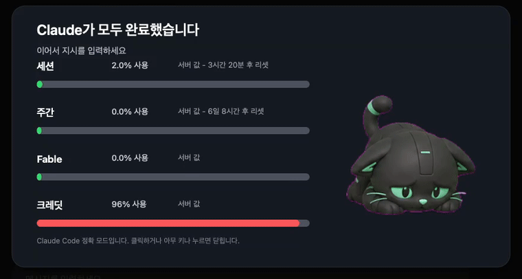

# Claude Pet Overlays

[English](README.md) · [한국어](README.ko.md) · [Español](README.es.md) · **日本語**

Claude Code が入力待ちになったとき、または質問をしたときに、全画面の Claude Pet オーバーレイを表示する macOS ネイティブの Claude Code プラグインです。

オーバーレイは初回実行時に小さな Swift/AppKit バイナリをビルドし、`uygnoey/claude-pet` の Patch アニメーションフレームを表示し、Claude Code の使用量データからトークンゲージを追加します。

## デモ



Claude Code がターンを終えるとペットは嬉しそうに**ジャンプ（jump）**し、質問するときは**レビュー（review）**アニメーションを再生します。

## 表示される内容

- すべてのディスプレイを覆う全画面オーバーレイ（アクティブなパネルはメインディスプレイに表示）
- 現在のトークン状態に応じて選ばれる Claude Pet アニメーション
- 使用量データがある場合のセッション・週間・モデル・クレジットのゲージ
- 英語・韓国語・スペイン語の UI テキスト

## インストール

```bash
claude plugin marketplace add https://github.com/uygnoey/claude-pet-overlays.git
claude plugin install claude-pet-overlays
```

インストール後は Claude Code を再起動してください。

## 必要要件

- macOS
- 初回のローカルビルドに必要な Xcode Command Line Tools:

```bash
xcode-select --install
```

## クイックテスト

```bash
bash scripts/notify.sh stop
bash scripts/notify.sh ask
```

どこかをクリックするか、任意のキーを押すとオーバーレイが閉じます。

## 基本設定

```bash
CLAUDE_PET_OVERLAY_LANG=ko bash scripts/notify.sh stop
CLAUDE_PET_OVERLAY_LANG=en bash scripts/notify.sh stop
CLAUDE_PET_OVERLAY_LANG=es bash scripts/notify.sh stop
CLAUDE_PET_OVERLAY_TIMEOUT=0 bash scripts/notify.sh stop
CLAUDE_PET_OVERLAY_MESSAGE="Review needed" bash scripts/notify.sh ask
```

対応するすべての環境変数と `~/.claude_pet.json` の設定については [docs/configuration.ja.md](docs/configuration.ja.md) を参照してください。

## トークン状態の仕組み

オーバーレイは Claude Pet と同じ優先順位を使用します。

1. Claude Code の OAuth 使用量エンドポイントから正確なサーバー側パーセンテージを取得
2. ローカルの Claude Code JSONL ログをフォールバックの推定値として使用

OAuth トークンは実行時に Claude Code のローカル認証情報または macOS キーチェーンから読み取られ、このプラグインが書き込むことはありません。

トークンのソース、上限、アニメーションのしきい値については [docs/configuration.ja.md](docs/configuration.ja.md) を参照してください。

## プロジェクトドキュメント

- [設定](docs/configuration.ja.md): 言語、タイムアウト、トークン上限、使用量ソース、アニメーションルール
- [開発](docs/development.ja.md): プロジェクト構成、ビルド/テストコマンド、フック、アセット、トラブルシューティング

## アセット

Patch のアニメーションフレームは [`uygnoey/claude-pet`](https://github.com/uygnoey/claude-pet) から取得しています。
